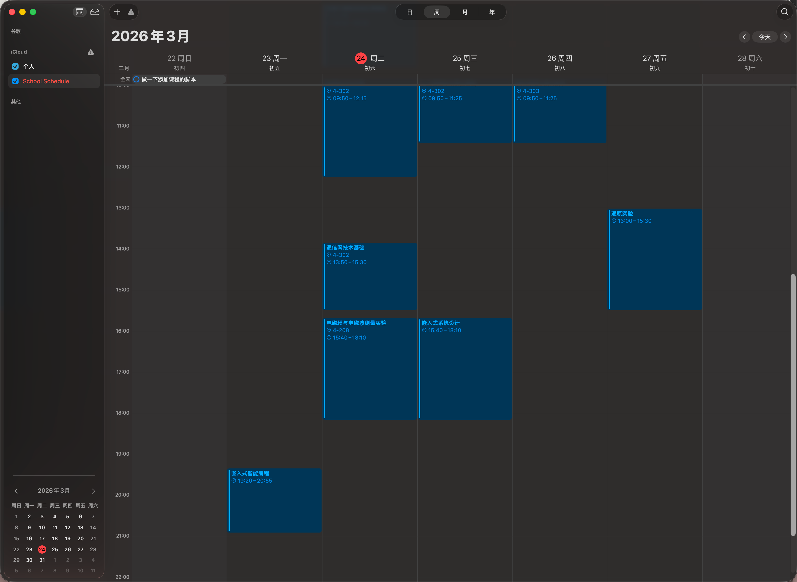
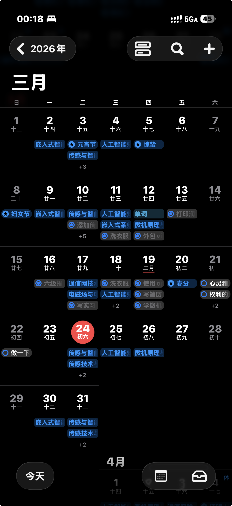

# yiquanfeng.github.io

个人主页 + 工具集，部署在 GitHub Pages。

## Schedule to ICS

将北邮「学生个人课表」XLS（或自定义 CSV）转换为 `.ics` 日历文件，可直接导入 iOS 日历、macOS 日历、Google Calendar 等任意支持 iCal 格式的软件。

### 使用方式

1. 打开 [Schedule to ICS](https://yiquanfeng.github.io/schedule-ics.html)
2. 选择**学期第一周的周一**日期
3. 上传课表文件（北邮教务系统导出的 XLS，或自定义 CSV）
4. 如有需要，在「临时课程」区域添加学期中只在某几周出现的课程
5. 点击「生成 ICS」
6. 下载生成的 `.ics` 文件，导入日历软件

### 导入日历

以下以 macOS / iOS 为例，安卓端操作类似。

**macOS**（推荐先从 macOS 导入，可自动同步到 iOS）

直接双击 `.ics` 文件，选择在 iCloud 中新建日历，导入后自动同步到 iOS。

**iOS**

- 方式一：通过上面 macOS 同步过来。
- 方式二：将 `.ics` 文件上传到支持直链分享的网盘，然后在「设置 → App → 日历 → 日历账户 → 添加账户 → 其他账户 → 已订阅的日历」中粘贴直链。

支持直链分享的网盘：

| 服务 | 费用 |
|------|------|
| 七牛云 | 免费 |
| Cloudflare R2 | 免费 |
| 阿里云 OSS / 腾讯云 COS | 付费 |

### 效果截图

### 文件结构

| 文件 | 说明 |
|------|------|
| `index.html` | 主页 |
| `schedule-ics.html` | Schedule to ICS 工具页面 |
| `schedule-ics.js` | XLS / CSV 解析与 ICS 生成逻辑 |
| `styles.css` | 全站样式 |
| `favicon.svg` | 网站图标 |
| `docs/` | 文档截图 |
